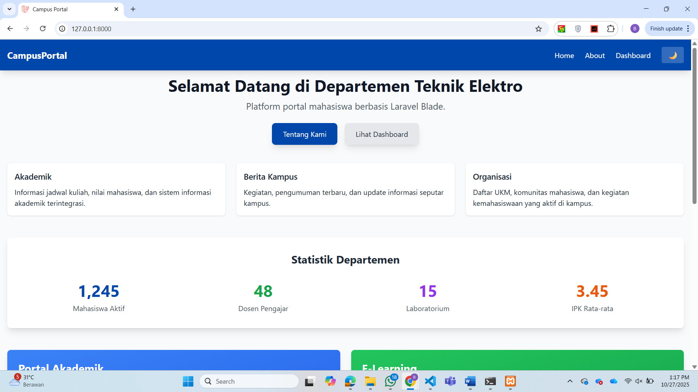
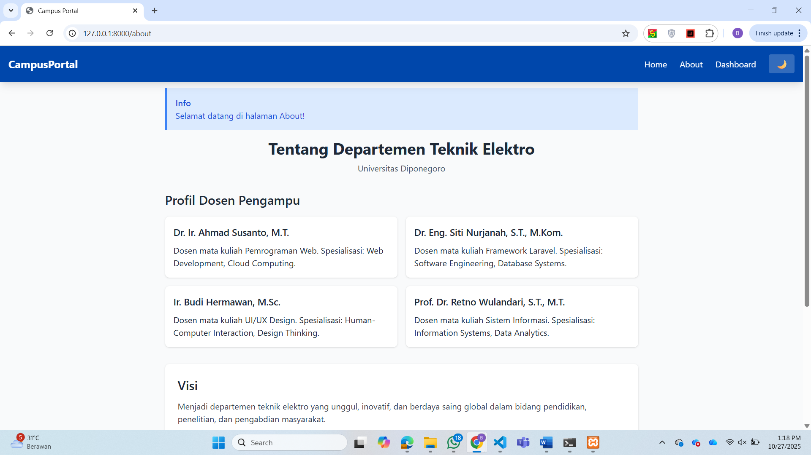
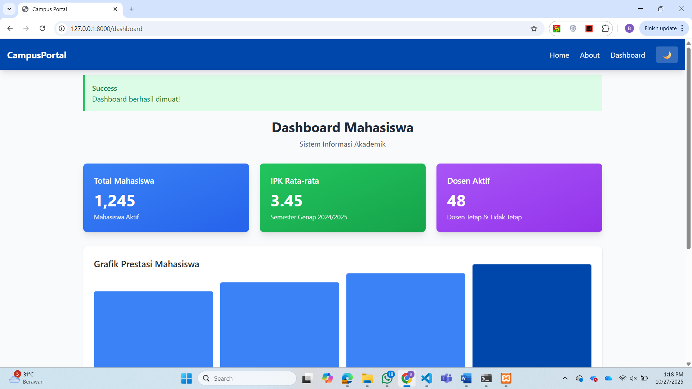
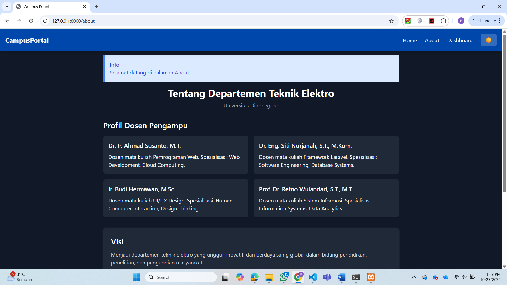
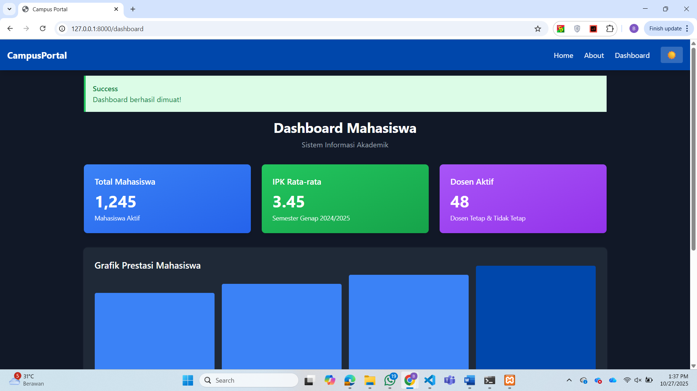

# Campus Portal - Laravel Blade Layout Frontend

Proyek ini adalah implementasi lengkap dari Campus Portal menggunakan Laravel dengan Blade Layout, Components, dan Vite untuk asset bundling modern.

## � Demo Screenshots

### Light Mode

<p align="center"><i>Halaman Home dengan tampilan Light Mode - Navbar biru Undip, statistik, dan berita terbaru</i></p>


<p align="center"><i>Halaman About dengan profil dosen dan informasi departemen</i></p>


<p align="center"><i>Halaman Dashboard dengan chart dan statistics cards</i></p>

### Dark Mode

<p align="center"><i>Halaman Home dengan Dark Mode aktif - Smooth transition dan styling yang konsisten</i></p>


<p align="center"><i>Halaman About dalam mode gelap dengan profil dosen dan informasi departemen</i></p>


<p align="center"><i>Dashboard dalam mode gelap dengan chart dan gradient cards</i></p>

---

## �📋 Fitur Utama

### Fitur Dasar
- ✅ **Blade Layout** (@extends, @section, @yield)
- ✅ **Blade Components** (x-navbar, x-card, x-footer, x-alert)
- ✅ **Asset bundling** menggunakan Vite
- ✅ **Tailwind CSS** untuk styling modern
- ✅ **Responsive Design** dengan grid system

### Challenge Bonus (SEMUANYA SUDAH DIIMPLEMENTASI ✅)
1. ✅ **Halaman About** - Menampilkan profil 4 dosen pengampu menggunakan `<x-card>`
2. ✅ **Dark Mode Toggle** - Tombol di navbar dengan JavaScript untuk toggle tema gelap/terang
3. ✅ **Halaman Dashboard** - Menampilkan grafik dummy (chart bar) tanpa library eksternal
4. ✅ **Component Alert** - `<x-alert>` untuk menampilkan notifikasi dengan 4 tipe (info, success, warning, error)
5. ✅ **Custom Theme Undip** - Warna biru Undip (#0047AB) sudah dikonfigurasi di `tailwind.config.js`

## 📁 Struktur File

```
resources/
├── views/
│   ├── layouts/
│   │   └── app.blade.php          # Layout utama
│   ├── components/
│   │   ├── navbar.blade.php       # Navbar dengan dark mode toggle
│   │   ├── footer.blade.php       # Footer
│   │   ├── card.blade.php         # Card component (reusable)
│   │   └── alert.blade.php        # Alert component (bonus)
│   └── pages/
│       ├── home.blade.php         # Halaman utama
│       ├── about.blade.php        # Halaman about (bonus)
│       └── dashboard.blade.php    # Halaman dashboard dengan chart (bonus)
├── css/
│   └── app.css                    # Tailwind CSS directives
└── js/
    └── app.js                     # JavaScript untuk dark mode toggle

routes/
└── web.php                        # Route definitions

tailwind.config.js                 # Konfigurasi Tailwind dengan warna Undip
postcss.config.js                  # Konfigurasi PostCSS
vite.config.js                     # Konfigurasi Vite
```

## 🚀 Cara Menjalankan

### Persiapan
Pastikan Anda sudah menginstall:
- PHP 8.2+
- Composer
- Node.js & NPM

### Langkah-langkah

1. **Install Dependencies**
```bash
composer install
npm install
```

2. **Setup Environment**
```bash
cp .env.example .env
php artisan key:generate
```

3. **Jalankan Development Server**

**Terminal 1 - Laravel Server:**
```bash
php artisan serve
```

**Terminal 2 - Vite Dev Server:**
```bash
npm run dev
```

4. **Buka Browser**
```
http://127.0.0.1:8000
```

## 🎨 Fitur Dark Mode

Dark mode dapat diaktifkan dengan:
1. Klik tombol 🌙/☀️ di navbar
2. Preferensi disimpan di localStorage
3. Otomatis apply ke seluruh halaman dengan smooth transition

## 📦 Components

### 1. Navbar Component
```blade
<x-navbar />
```
Fitur:
- Logo CampusPortal
- Menu navigasi (Home, About, Dashboard)
- Dark mode toggle button
- Warna tema Undip (#0047AB)

### 2. Card Component
```blade
<x-card 
    title="Judul Card" 
    body="Deskripsi card..." 
/>
```
Fitur:
- Reusable
- Hover effect
- Dark mode support

### 3. Footer Component
```blade
<x-footer />
```
Fitur:
- Copyright information
- Dark mode support

### 4. Alert Component (Bonus)
```blade
<x-alert 
    type="success" 
    message="Operasi berhasil!" 
/>
```
Tipe tersedia: `info`, `success`, `warning`, `error`

## 🎯 Halaman-halaman

### 1. Home (`/`)
- Welcome message
- 3 card informatif (Akademik, Berita Kampus, Organisasi)
- Layout responsive grid

### 2. About (`/about`)
- Informasi departemen
- Profil 4 dosen pengampu
- Visi dan Misi
- Alert notification

### 3. Dashboard (`/dashboard`)
- 3 statistics cards dengan gradient
- Chart bar IPK per tahun (CSS-based, tanpa library)
- Jadwal kuliah
- Pengumuman
- Menggunakan warna custom Undip

## 🎨 Tailwind Configuration

Custom color sudah ditambahkan:
```javascript
colors: {
  'undip-blue': '#0047AB',
}
```

Gunakan di class:
```html
<div class="bg-undip-blue text-white">...</div>
```

## 📝 Tips Development

1. **Live Reload**: Setiap perubahan di file `.blade.php` atau `.js` akan otomatis reload
2. **Tailwind Classes**: Gunakan dokumentasi [tailwindcss.com/docs](https://tailwindcss.com/docs)
3. **Dark Mode**: Tambahkan prefix `dark:` untuk styling mode gelap
   ```html
   <div class="bg-white dark:bg-gray-800">...</div>
   ```

## 🏆 Output Akhir

✅ **Struktur folder lengkap** sesuai requirement
✅ **Tampilan rapi dan responsif**
✅ **Komponen reusable** dengan props
✅ **CSS & JS bundling** dengan Vite berhasil
✅ **SEMUA Challenge Bonus** sudah diimplementasi (+10%)

## 📸 Preview

### Light Mode
- Navbar biru Undip (#0047AB)
- Card dengan shadow dan hover effect
- Footer gelap
- Layout responsif

### Dark Mode
- Background gelap
- Text terang
- Smooth transition
- Preferensi tersimpan

## 🔧 Troubleshooting

### Vite tidak running
```bash
npm install
npm run dev
```

### Tailwind classes tidak work
```bash
npm run build
php artisan optimize:clear
```

### Dark mode tidak save
Pastikan browser support localStorage dan JavaScript enabled.

## ‍💻 Dibuat oleh

**Banar Pambudi**  
Departemen Teknik Elektro  
Universitas Diponegoro  
2025

[](https://linkedin.com/in/banarpambudi)
[](https://github.com/bnrpmbd)

---

**Built with ❤️ using Laravel & Tailwind CSS**
